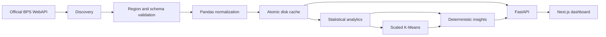
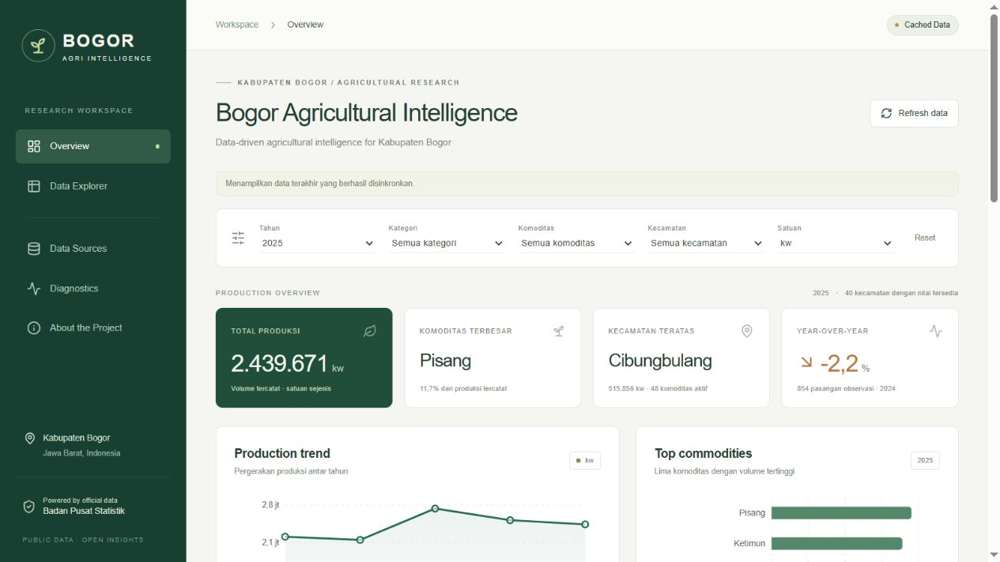

# Bogor Agricultural Intelligence

**Data-driven agricultural intelligence for Kabupaten Bogor**

## 1. Project Overview

A full-stack research dashboard that discovers official BPS tables, validates geography, normalizes agricultural observations, and explains patterns with statistics and exploratory machine learning.

Live access verified on **27 September 2026**: Jawa Barat `3200`, Bogor `3201`, SIMDASI `wilayah=Kabupaten Bogor`, `induk=3201000`. Ingestion discovered 18 agricultural candidates and selected 8 tables: **30,120 observations, 40 kecamatan, 2021–2025**, with 8,513 numeric values and 21,607 missing values. These are dated execution results, not hardcoded dashboard content.

## 2. Features

- Metadata-ranked discovery and geography validation; no fixed table IDs.
- Production KPIs, matched-observation YoY, rankings, annual charts, trends and volatility.
- Deterministic insights with expandable evidence and provenance.
- K-Means model selection and explicit insufficient-data states.
- Searchable, sortable, paginated explorer and filtered CSV export.
- Sources, diagnostics, methodology pages and responsive layout.
- 24-hour cache, manual refresh and last-good-cache preservation.
- No demo or random observations in the application.

## 3. Architecture



Browser requests use same-origin `/api/*`, proxied to FastAPI. Filters never query BPS directly. The API key stays exclusively in the backend.

## 4. Tech Stack

Python, FastAPI, pandas, NumPy, scikit-learn, httpx, Pydantic, lxml; Next.js, TypeScript, Tailwind CSS, Recharts, Lucide. Tested on Windows with Python 3.14 and Node.js 24. Tested dependency versions are recorded in `backend/requirements.lock.txt` and `frontend/package-lock.json`.

## 5. BPS Data Source

[Official BPS API documentation](https://webapi.bps.go.id/documentation/).

- `3200` = Jawa Barat.
- `3201` = Kabupaten Bogor legacy BPS domain (response name: Bogor).
- `3201000` = expected 7-digit SIMDASI wilayah identifier, verified at runtime.

Actual discovered tables include production of annual fruits/vegetables, seasonal vegetables/fruits, and seasonal harvested area, each by kecamatan. The Sources page lists selected titles, IDs, available/ingested years, units and timestamps. Original responses are preserved locally after credential sanitization.

## 6. BPS API Key Setup

Obtain a key from the [BPS developer portal](https://webapi.bps.go.id/developer/). Edit `backend/.env`, or copy `.env.example` on a fresh checkout:

```dotenv
BPS_API_KEY=PASTE_MY_BPS_API_KEY_HERE
BPS_PROVINCE_DOMAIN=3200
BPS_BOGOR_DOMAIN=3201
BPS_BOGOR_SIMDASI_WILAYAH=3201000
BPS_API_BASE_URL=https://webapi.bps.go.id
```

Never use frontend/public environment variables for the key. `.env`, caches and virtual environments are ignored by Git. Transport errors omit URLs; upstream credential echoes are sanitized; httpx URL logging is disabled. Process environment variables override `.env`; restart after editing credentials.

## 7. Kabupaten Bogor Data Discovery

1. Validate province/regency IDs and returned names, rejecting Kota Bogor.
2. Request SIMDASI `id/23`; verify region metadata.
3. Rank agriculture metadata by production, district dimension, commodity keywords, explicit years and units.
4. Retrieve `id/25` for the latest five explicit available years, preferring 2021 onward.
5. Normalize relevant district production and harvest tables.
6. If usable production is absent, try Bogor static tables, Bogor CSA tables, then Jawa Barat static/CSA tables.

The legacy static detail path `/v1/view` returned 404 in live testing; the client successfully retried `/v1/api/view`. HTML adapters support inspected annual commodity totals and provincial commodity-column layouts. They distinguish the Kabupaten section from Kota/City, even when both contain Bogor. CSA details with the observed SIMDASI shape share its adapter. Unknown HTML/dynamic formats fail closed and remain in diagnostics.

## 8. Running Locally

Backend, PowerShell terminal 1 (adjust the checkout path):

```powershell
cd E:\project\bogor-agricultural-intelligence\backend
python -m venv .venv
.venv\Scripts\Activate.ps1
python -m pip install -r requirements.lock.txt
# Configure .env, then run the diagnostic BEFORE starting the backend:
python scripts/diagnose_bps.py
python -m uvicorn app.main:app --host 127.0.0.1 --port 8000 --reload
```

Linux/macOS activation: `source .venv/bin/activate`.

Frontend, terminal 2:

```powershell
cd E:\project\bogor-agricultural-intelligence\frontend
npm ci
npm run dev
```

Open [the dashboard](http://127.0.0.1:3000). Production mode: `npm run build`, then `npm run start`. Backend binds to loopback. Public deployment needs authenticated/rate-limited refresh, a process manager, deployment configuration and shared storage for multiple workers.

For a persistent Windows preview after installation and build, run from the project root:

```powershell
powershell -NoProfile -File scripts/start-local.ps1
```

This starts both servers in hidden windows, bound to loopback. Logs and process IDs are saved in `.local/` (ignored by Git). It refuses occupied ports and never stops unrelated processes.

## 9. Running Diagnostic

Run from backend:

```powershell
python scripts/diagnose_bps.py
# Reprocess official raw responses under 24 hours old:
python scripts/diagnose_bps.py --cached
# Inspect all fallback sources, even if SIMDASI succeeds:
python scripts/diagnose_bps.py --cached --discovery-only
python -m unittest discover -s tests -v
python -m compileall -q app scripts tests
```

Exit 0 = usable successful ingestion; 1 = partial/failed refresh with retained data or discovery-only inspection; 2 = blocked authentication/geography. Cached mode does not claim a new connection.

Live tests are separately opt-in:

```powershell
$env:RUN_BPS_INTEGRATION='1'
python -m unittest discover -s tests/integration -v
Remove-Item Env:RUN_BPS_INTEGRATION
```

Offline tests use sanitized real BPS fixtures and explicitly synthetic mathematical cases. Test data is never served to users.

## 10. Backend

[Interactive OpenAPI reference](http://127.0.0.1:8000/docs).

| Endpoint | Purpose |
|---|---|
| GET /api/health | Liveness |
| GET /api/bps/status | Connection, cache and quality |
| GET /api/bps/tables | Selected and discovered metadata |
| POST /api/bps/refresh | Start refresh (202); poll status |
| GET /api/agriculture/options | Filter values |
| GET /api/agriculture/data | Search, filter, sort, pagination, CSV |
| GET /api/agriculture/summary | KPIs and rankings |
| GET /api/agriculture/trends | Annual totals, complete-panel trends/CV |
| GET /api/agriculture/clusters | Eligibility, features, selection, centroids |
| GET /api/agriculture/insights | Prioritized explainable insights |
| GET /api/agriculture/dashboard | Combined response |

Filters: `year`, `district`, `commodity`, `category`, `unit`. Explorer adds `indicator`, `search`, `sort`, `direction`, `page`, `page_size` (maximum 200), `export=csv`. CSV includes every filtered observation, not just the page; text formula prefixes are escaped.

Cache lives in `backend/data/cache/`. Raw responses have timestamps and key-free parameters; `normalized.json` stores observations, provenance, diagnostics and default analytics. Atomic replacement occurs only after validation and calculations succeed. Failed refresh preserves the previous valid cache. Missing/stale cache triggers one startup refresh; manual refresh always requests new data. Read endpoints serve the snapshot. Cached reprocessing retains the oldest reused source timestamp instead of renewing freshness. Restarted processes show Cached Data until a fresh connection succeeds. The implementation targets a single local backend process.

## 11. Frontend

Routes: `/`, `/data`, `/sources`, `/diagnostics`, `/about`. Global filters update cards, charts, rankings, insights and clustering. Incompatible unit/filter combinations display unavailable states. Charts have accessible descriptions and expandable text values. Controls support keyboard focus, reduced motion, skeletons and responsive layouts. Tables scroll on small screens. Rankings replace maps until verified boundaries are available.

Checks: `npm run typecheck` and `npm run build` from frontend.

## 12. Machine Learning Method

Features: total/average observed production, positive commodity count, matched YoY and complete-panel volatility where available. IDs never enter the matrix. Districts need at least two numeric commodity cells and 60% cell coverage; at least six eligible districts are required. Features need 60% nonmissing coverage and nonzero variance. Remaining gaps are median-imputed, then StandardScaler precedes KMeans (`random_state=42`, 20 initializations).

Compare k=2..6, bounded by sample/unique count; reject singleton clusters, choose the highest positive silhouette score. Interpret centroids relative to production/diversification medians. Labels have no inherent ordering. This is exploratory, not predictive or causal. The initial all-category kw selection does not have sufficient coverage; no clusters are fabricated.

## 13. Insight Methodology

- Sum only production in a selected unit; unknown units never aggregate.
- Preserve `kw` (kuintal) and scaled labels such as `ribu ton`.
- Exclude regency totals from district data to avoid double counting.
- Preserve nulls; symbols become zero only if the source legend explicitly means zero.
- Validate Indonesian digit grouping; malformed numeric strings remain unavailable.
- Deduplicate by year/geography/commodity/category/indicator/unit; conflicting duplicates stop refresh.
- Merge only case-only commodity-name variants, using the latest observed label.
- YoY uses matched district–commodity pairs in consecutive years and reports pair counts.
- Growth/decline insights need a base at least 1% of prior observed total and 80% pair coverage.
- Trends and sample-standard-deviation CV require at least three annual values using complete district panels.
- Relative annual slope above +2% = Increasing, below -2% = Decreasing, otherwise Stable.
- Prioritize data-quality cautions/material changes; show up to six insights with source/evidence.

## 14. Data Limitations

Missingness is substantial and is not automatically zero. Totals/rankings describe recorded observations, not complete output or economic value. Annual chart coverage can change; matched-panel YoY can differ from percentages computed from raw chart totals. Units are not converted without an explicit rule. Categories derive from discovered titles; broader commodity aliases need source evidence. Unknown schemas require review. Provincial fallback describes the regency and never invents district estimates.

**Data source: Badan Pusat Statistik (BPS). Analyses and derived insights are generated by this application and are not official BPS conclusions.**

## 15. Screenshots

Desktop and mobile captures are stored in `docs/screenshots/`. The running app is the interactive preview; screenshots never supply observations.



## 16. Future Improvements

Additional audited CSA/dynamic adapters, commodity alias evidence, comparison coverage controls, reliable GeoJSON, richer BPS quality flags, authenticated hosted refresh, background jobs and a shared database cache.

## Kepatuhan penggunaan BPS

Lihat [pemeriksaan ketentuan BPS](docs/BPS-COMPLIANCE.md) sebelum publikasi atau perubahan tujuan penggunaan. Implementasi lokal ini untuk riset/portofolio nonkomersial. Pastikan token dan identitas aplikasi sesuai pendaftaran BPS; monetisasi yang dicakup larangan API memerlukan pengaturan dengan BPS.

